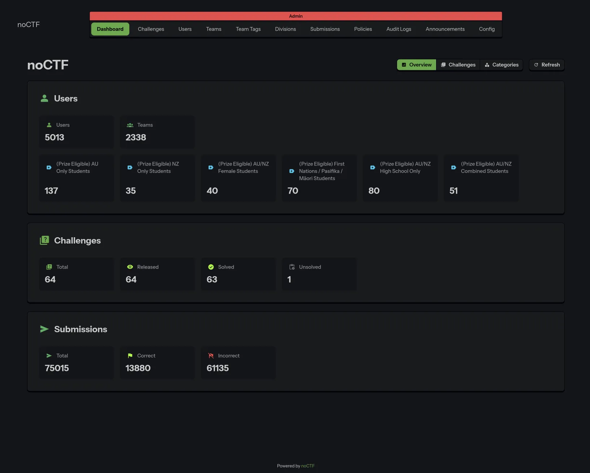
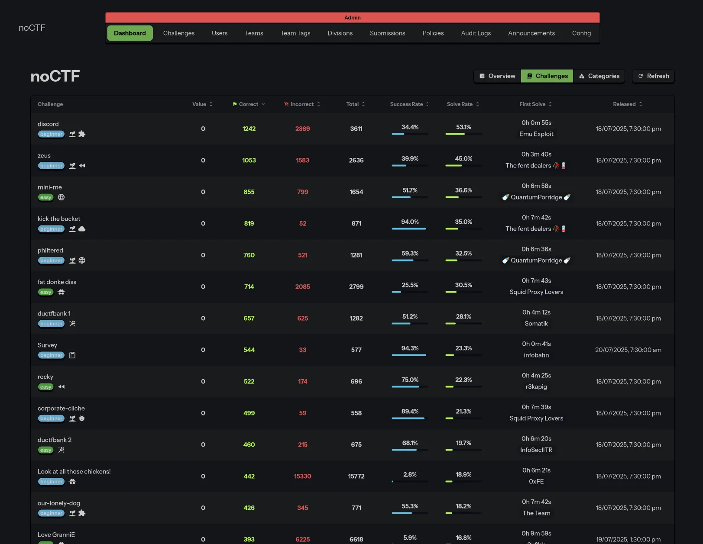

# Dashboard

When you access the noCTF admin panel, you'll be greeted with an overview of basic CTF statistics to
help you quickly understand the state of your event. By default, this data will be exported when you
take a static snapshot of your CTF.

The **Challenges** tab provide more detailed insights for each challenge, including:
* Solve and success rates
* The first team to solve each challenge
* The effective release time (calculated as the later of the challenge’s `visible_at` time and the
CTF’s start time)

The **Categories** tab also summarises statistics for each category, giving you a high-level view of
performance across different challenge types.
